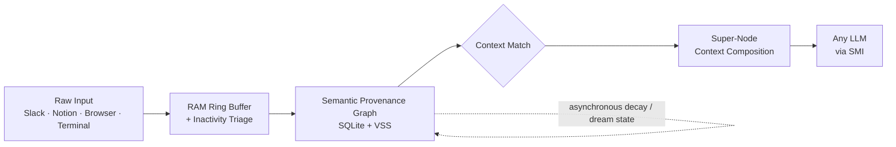

<div align="center">

# ☀️ Saule

### The Semantic Memory Layer for the post-model world

**Models are commodities. Memory is the moat.**

[](#license)
[](#status)
[](#why-saule)
[](#architecture)
[](#the-semantic-provenance-graph)

[White Paper](http://localhost:3000/en/book) · [Quick Start](#quick-start) · [Architecture](#architecture) · [Comparison](#how-is-this-different-from-x) · [Roadmap](#roadmap)

</div>

---

## Why Saule?

Every AI provider is racing to make reasoning cheaper, faster, and more accessible. That race is good for the world — and terrible as a place to build a proprietary moat.

When reasoning is a commodity, the only thing that isn't is **what the model runs on**. Your decisions, your team's tacit knowledge, the alternatives you ruled out three months ago — none of that lives in any base model, and none of it should live locked inside one vendor's closed memory feature either.

Saule is an independent **Semantic Memory Layer (SML)** — a piece of open infrastructure that sits between you and whatever model you're using, preserving the context that models inherently forget:

- **Not a vector DB.** Vector search is treated as a low-level similarity index, not the memory structure itself.
- **Not a static knowledge graph.** Knowledge graphs are rigid. Saule's graph decays, reinforces, and reorganizes itself asynchronously over time based on usage.
- **Not RAG.** RAG retrieves arbitrary chunks. Saule reconstructs *context* — who decided what, when, in which environment, and why.
- **Not MCP.** MCP is a pipe between models and data sources. Saule is the memory compiler running *through* the pipe.

Models change. Providers rise and fall. Your memory should outlive all of it.

---

## The Problem, Concretely

> Three months ago, your team chose Postgres `JSONB` over MongoDB. The detailed trade-off reasoning lived in a Slack thread that's now buried under 40,000 other messages.
> 
> A new engineer joins, asks "why not Mongo?", and nobody remembers the exact constraints. You waste six hours re-litigating a decision that was already made — because the *decision* survived in your schema, but the *context* around it did not.

This isn't a documentation problem. It's a **memory architecture** problem. Every tool you use — Slack, Notion, Git, browser, terminal — remembers a disconnected fragment. None of them preserve the unified narrative.

---

## How is Saule Different?

| Feature | Vector DB | Knowledge Graph | RAG Pipeline | MCP | **Saule (SML)** |
|:---|:---:|:---:|:---:|:---:|:---:|
| **Semantic Similarity Search** | ✅ | ❌ | ✅ | ❌ | **✅ Yes** |
| **Temporal & Causal Graphing** | ❌ | ❌ | ❌ | ❌ | **✅ Yes** |
| **Provenance Tracking (Who/When/Why)**| ❌ | ⚠️ Partial | ❌ | ❌ | **✅ Yes** |
| **Hebbian Decay & Reinforcement** | ❌ | ❌ | ❌ | ❌ | **✅ Yes** |
| **Model Independence (SMI)** | ✅ | ✅ | ✅ | ✅ | **✅ Yes** |
| **Local-First / Zero-Knowledge Sync** | ❌ | ❌ | ❌ | ❌ | **✅ Yes** |
| **Cross-App/Team Network Effect** | ❌ | ❌ | ❌ | ❌ | **✅ Yes** |

> [!NOTE]  
> **vs. Closed Vendor Memory (OpenAI/Claude Memory):** Those offer flat, key-value recall locked to a single model, stored on someone else's cloud, with no portability, zero local privacy, and no collective team utility. Saule is built to be the exact opposite of that on every axis.

---

## Architecture & Innovations

Saule is built on three core pillars:

### 1. The Semantic Provenance Graph (SPG)
Instead of storing plain text chunks, every memory unit carries its full metadata lineage: **when** it was created, **who** created it, **what application** it originated from, and **why** it relates to everything around it.

```json
{
  "id": "mem_01h8x9",
  "type": "episodic",
  "content": "Decided to use Postgres JSONB for flexible schema indexing.",
  "embedding": [0.012, -0.045, "..."],
  "created_at": 1783156054,
  "decay_weight": 0.98,
  "provenance": {
    "app_name": "slack",
    "window_title": "#architecture-discussion",
    "url": "https://slack.com/archives/C12345",
    "author": "dev_jane",
    "workspace_id": "team_core"
  }
}
```
Edges between nodes carry semantic, temporal, *and causal* relationships (`postgres_chosen_because_of_jsonb_indexing`), each with its own confidence score and decay weight.

### 2. Autonomic Observation & Low-Resource Passive Ingestion
Passive memory engines usually destroy battery life and SSDs through continuous disk writes and heavy embedding models. Saule solves this via:
* **RAM-Only Volatile Ring Buffer (Write Coalescing):** Keyboard inputs, window changes, and clipboard copies are captured in memory first. Only when the *Attention Filter* detects a focus shift or a completed episode, the data is batched and written to SQLite in a single transaction.
* **Inactivity Handling (Idle State Transition):** If no inputs are detected for 3 minutes, the observer pauses. The episode boundary is timestamped retroactively to the last user interaction, eliminating "ghost attention" bloat.
* **Two-Stage Retrieval (CPU Safety):** Before calling heavy embedding models, local context is evaluated via a lightning-fast keyword triage (BM25). Vector similarity (ONNX `nomic-embed`) is computed only if the triage threshold is met.

### 3. Dual-Mode User Sovereignty (Psychological Safety)
Users toggle between two modes using a single shortcut (`Ctrl+Shift+P` / Tauri UI):
* **Autonomic Mode (Subconscious / Active Listening):** Background daemon gathers digital context passively. Sensitive apps (banking, password managers, incognito) are blacklisted automatically.
* **Interactive Mode (Conscious / Manual Trigger Only):** The passive observer is shut down entirely. The database is updated strictly upon explicit user request: triggering the `Alt+Space` SML Terminal HQ, right-clicking text to "Remember in Saule", or recording voice notes.

### 4. Cryptographic Identity & BIP-39 Key Derivation (Roadmap Spec)
To guarantee absolute user ownership:
* **Mnemonic Seed Phrases**: Instead of traditional passwords, Saule will generate a standard 12 or 24-word BIP-39 mnemonic phrase.
* **Offline Key Derivation**: The 256-bit Data Encryption Key (DEK) used for SQLite AES-GCM encryption is derived directly from this master seed offline using PBKDF2/Argon2.
* **Zero Central Storage**: Seed phrases and keys are stored exclusively in the device's secure system keychain (Windows Credential Manager / macOS Keychain) and never touch any cloud server.
* **Web3-Style Restoration**: If you switch devices, you restore your database sync connection simply by entering your 12/24-word phrase on the new device, reconstructing the encryption key locally.

---

## Technical Flow



---

## Status & Honesty Check

> [!IMPORTANT]  
> **Honesty Check:** Whitepapers and developer READMEs often lie by omission. We'd rather not.

The 6-layer Cognitive OS architecture described in the full technical spec is the **long-term target design**, not the current build. What is running today:

* **✅ Local Core SML Engine & REST Microservice (v2.0)**: Standalone headless Express server running locally on port `4000`. Fully decoupled database layer using `better-sqlite3` with AES-GCM application-level encryption. Local ONNX embedding execution (`all-MiniLM-L6-v2`) with pre-warmup compilation to eliminate cold-starts.
* **✅ Local-First Developer Console**: The getsaule web app (`localhost:3000/app`) functions 100% offline, connecting directly to the local SML server via the SMI API proxy.
* **🔜 Local Passive Observers**: Desktop Tauri hooks and cross-browser extensions for background window capture (Phase 1 - In Progress).
* **🔜 Zero-Knowledge Sync**: Local P2P key exchange (ECDH/RSA) or BIP-39 seed phrase recovery to sync workspace memory relays securely across teams without cloud exposure (Phase 2 - Planned).

---

## Quick Start (Local REST Microservice)

To start the local SML microservice, navigate to `saule-core` and boot the server:

```bash
cd saule-core
npm install
npm start
```
The server will warm up the local ONNX model and start listening on `http://localhost:4000`.

### Ingesting Memory Context

Send a POST request to the local SMI `/ingest` endpoint:

```bash
curl -X POST http://localhost:4000/api/smi/ingest \
  -H "Content-Type: application/json" \
  -d '{
    "content": "Decided to use Postgres JSONB to avoid premature MongoDB schema locks.",
    "category": "knowledge",
    "type": "decision",
    "spaceId": "workspace_ac_test",
    "provenance": {
      "appName": "slack",
      "author": "dev_jane"
    }
  }'
```

### Recalling Context

Query the SML memory graph:

```bash
curl -X POST http://localhost:4000/api/smi/recall \
  -H "Content-Type: application/json" \
  -d '{
    "query": "Why did we choose Postgres JSONB?",
    "spaceId": "workspace_ac_test",
    "spaceType": "personal"
  }'
```
This returns the chronologically ordered and causally composed sub-graph context nodes from SQLite, decrypted on-the-fly.

---SDKs available in **TypeScript**, **Python**, and **Rust**.

---

## Roadmap

* **Phase 1: Personal SML & Local Core (Q1-Q2)**  
  SQLite graph schema, local Cognitive API (`remember`/`recall`/`connect`), local nomic-embed / Llama-3-8B local inference, browser extension + SML Terminal UI.
* **Phase 2: Workspace Memory & Transactive Sync (Q3)**  
  Slack, Notion, and GitHub ingestion integrations. P2P encrypted key exchange (Zero-Knowledge) over Firestore relay to prevent corporate amnesia across teams.
* **Phase 3: Open Memory Protocol (OMP) (Q4)**  
  A standardized, encrypted cross-application memory protocol allowing independent agents and apps to query and plug into Saule via unified API contracts.
* **Phase 4: Semantic OS (2027)**  
  Building the complete cognitive operating system layer sitting directly on top of physical hardware and cloud hosting.

---

## Contributing

Saule is open-core. If you are building autonomous agents, developer tools, or context-aware assistants that need memory extending beyond a single session chat box — we want your feedback more than your GitHub stars (though we won't say no to either).

* 🐛 Found a bug in the SPG traversal algorithms? Open an issue.
* 🧠 Built a custom decay policy agent or BM25 weight adjuster? Send a PR.
* 📖 Read the full [White Paper](http://localhost:3000/en/book) for the cognitive-science research behind our memory architectures.

---

<div align="center">

**Intelligence is general. Memory is yours.**

© 2026 PEH · [peh.solutions](https://peh.solutions)

</div>
